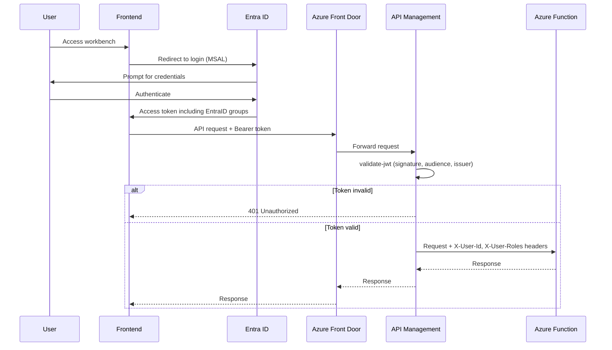

# Unified Authentication

## Overview

A single Entra ID App Registration that serves as the authentication entry point for all workbench components (Operations, Pricing, Claims etc). Users authenticate once and receive a token valid across all components, eliminating the need for multiple Enterprise Applications.

## Context

- Applies to all workbench components
- Must be implemented before any component-specific authorization patterns.

## Problem

We need to provide a secure mechanism for colleagues to authenticate to workbench, which uses/reuses existing technologies and components where possible.

The solution should be as simple as it can be, while providing enterprise-grade security.

# Directives and Constraints

- EntraID is the de-facto identity provider for Hiscox
- EntraID a an authoritative source for group memberships, which would map to application roles and workbench entitlements
- Avoid implementing multiple App Registrations and Enterprise Applications to minimze administrative overhead

## Solution

Register a **single Entra ID App Registration** representing the workbench as a whole. All components share this identity for authentication. Component-level access control is handled via **Entra ID groups and App Roles** rather than separate applications.

- **Key design decisions**:
  - One App Registration with multiple App Roles (e.g., `Operations.Read`, `Pricing.Write`, `Claims.Admin`).
  - Azure API Management validates the JWT once at the gateway — individual Azure Functions do not re-authenticate.
  - Entra ID groups map to App Roles via group claims, enabling role-based access per component.

- **Component interactions**:
  - Azure Front Door terminates TLS and routes to API Management.
  - API Management validates the bearer token against the single App Registration.
  - Downstream Azure Functions receive validated claims via request headers.

- **Data flow**:
  1. User authenticates against the single App Registration (via MSAL in the frontend).
  2. Entra ID issues an access token containing group memberships and app roles.
  3. Frontend sends token to Azure Front Door.
  4. Front Door forwards to API Management.
  5. API Management `validate-jwt` policy verifies the token signature, audience, and issuer.
  6. API Management forwards the request with user claims to the appropriate Azure Function.

## Implementation

### Components

| Component | Responsibility |
|-----------|---------------|
| Entra ID App Registration | Single identity for the workbench; defines App Roles and API scopes |
| Entra ID Groups | Map users to roles (e.g., `WB-Operations-Users`, `WB-Pricing-Admins`) |
| Azure Front Door | Entry point for inbound requests. Geo-redundant traffic routing. WAF protection |
| Azure API Management | Token validation, role enforcement via policies |
| Azure Functions | Consume validated claims; enforce fine-grained authorization |

### Configuration

| Setting | Description |
|---------|-------------|
| `AzureAd:TenantId` | Entra ID tenant ID |
| `AzureAd:ClientId` | Workbench App Registration client ID |
| `AzureAd:Audience` | `api://{workbench-app-client-id}` |

## Considerations

- **Security implications**: A single app registration means compromising its credentials affects all components. Mitigate with certificate-based credentials stored in Key Vault and short-lived tokens.
- **Performance characteristics**: Token validation at the API Management layer avoids repeated validation in each Function. Cached JWKS keys keep validation fast.
- **Multi-tenancy impact**: The single registration supports multi-tenant configurations if the workbench is extended to external cedents or reinsurers. Token claims identify the tenant context.
- **Auditability requirements**: The `X-User-Id` header propagated from the validated token ensures every downstream action is traceable to an authenticated user. All authentication events are logged in Entra ID sign-in logs.

## Related Patterns

- Authorization (component-level role enforcement — to be defined)
- API Gateway Routing (Front Door + API Management topology — to be defined)